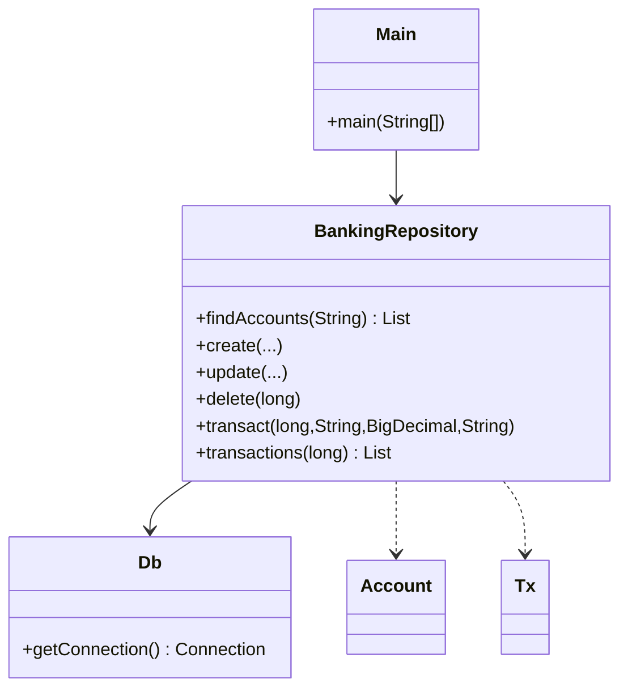

# Class diagram

```mermaid
classDiagram
 class Main { +main(String[]) }
 class Db { +getConnection() Connection }
 class BankingRepository {
   +findAccounts(String) List
   +create(...)
   +update(...)
   +delete(long)
   +transact(long,String,BigDecimal,String)
   +transactions(long) List
 }
 Main --> BankingRepository
 BankingRepository --> Db
 BankingRepository ..> Account
 BankingRepository ..> Tx
```

`Main` controls the Swing GUI, `BankingRepository` runs parameterized SQL, and `Db` creates JDBC connections.
